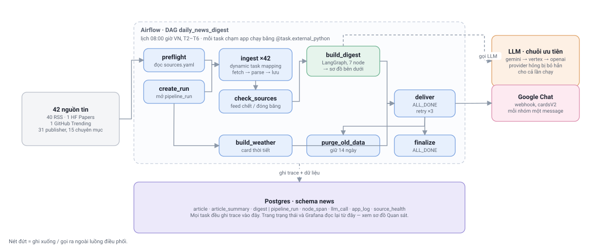
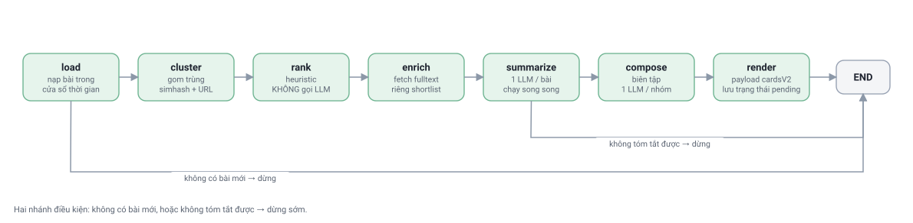
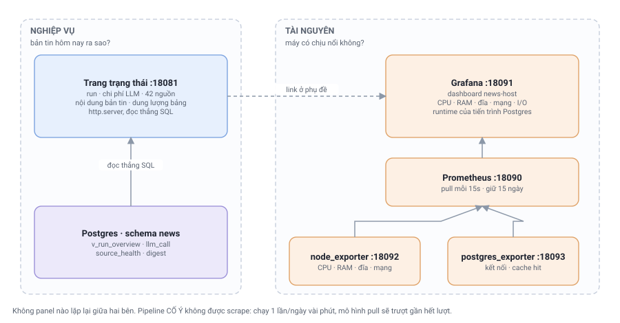

# updating-news

Bot tổng hợp tin tức hằng ngày, bắn bản tin lên **Google Chat** qua webhook.

- **Nguồn tin**: 42 feed đang bật — 40 RSS + 1 Hugging Face Papers + 1 GitHub Trending, từ 31 publisher (VnExpress, Thanh Niên, CafeF, VnEconomy, BBC World, CNBC, Federal Reserve, ECB, SEC, Hacker News, MIT Technology Review, TechCrunch…), trải 15 chuyên mục.
- **Xử lý**: LangGraph 7 node — gom trùng → xếp hạng → bổ sung fulltext → tóm tắt → biên tập → render card.
- **Trace & logging**: Postgres (`pipeline_run`, `node_span`, `llm_call`, `app_log`, `source_health`).
- **Lịch chạy**: Airflow DAG `daily_news_digest`, 08:00 giờ VN, T2–T6.
- **Quan sát**: trang trạng thái `:18081` lo nghiệp vụ, Grafana `:18091` lo tài nguyên máy.

Báo cáo khảo sát nguồn tin: [docs/REPORT.md](docs/REPORT.md). Vận hành thường trú: [docs/OPERATIONS.md](docs/OPERATIONS.md).

---

## Kiến trúc



### Phân vai: Airflow điều phối, LangGraph lo nội dung

**Airflow** giữ những thứ cần nhìn thấy và can thiệp được từ bên ngoài: lịch chạy, retry theo từng bước, fan-out 42 nguồn thành 42 task độc lập, và trạng thái "task nào hỏng" hiện ngay trên UI.

**LangGraph** giữ phần suy luận về nội dung. Toàn bộ 7 node nằm gọn trong **một** task Airflow (`build_digest`) chứ không tách thành 7 task. Lý do: state giữa các node là object Python lớn — hàng trăm bài với fulltext. Đẩy qua XCom nghĩa là serialize vào Postgres rồi đọc lại ở mỗi bước, vừa chậm vừa phình DB, đổi lại chẳng được gì vì retry một node LLM riêng lẻ không có ý nghĩa khi state đã mất.

Vài điểm trong sơ đồ dễ đọc nhầm nếu chỉ nhìn tên task:

- **`preflight` và `create_run` chạy song song**, không nối tiếp. `create_run` chỉ cần ngày logic để mở bản ghi `pipeline_run`; `preflight` đọc `sources.yaml`. `ingest` mới là chỗ cần cả hai.
- **`build_weather` không phụ thuộc `check_sources`.** Card thời tiết không liên quan gì tới sức khoẻ feed, nên nó treo thẳng từ `create_run` và chạy song song với `build_digest`.
- **`deliver` dùng `trigger_rule=ALL_DONE`**, nghĩa là vẫn chạy kể cả khi nhánh trước hỏng — thà gửi bản tin thiếu nhóm thời tiết còn hơn không gửi gì.
- **`finalize` không nằm sau `purge_old_data`.** Cả hai đều treo thẳng từ `deliver`; dọn dữ liệu cũ không được phép chặn việc chốt sổ một lần chạy.

### Bên trong `build_digest`



Thứ tự này không tuỳ tiện — nó được xếp để **tiền LLM tiêu càng muộn càng tốt**:

| Node | Việc | Vì sao đặt ở đây |
|---|---|---|
| `load` | nạp bài trong cửa sổ thời gian | đọc từ Postgres, không gọi mạng |
| `cluster` | gom bài trùng / cùng sự kiện | simhash + URL canonical. Trùng bị loại **trước** khi tốn token |
| `rank` | chấm điểm chọn shortlist | **heuristic, không gọi LLM**. Xếp hạng 500 bài bằng LLM vừa đắt vừa chậm |
| `enrich` | fetch fulltext | chỉ fetch shortlist, không fetch cả vài trăm bài |
| `summarize` | tóm tắt từng bài | 1 lần gọi LLM / bài, chạy song song bằng thread pool |
| `compose` | biên tập bản tin | 1 lần gọi / nhóm. Không gộp chung vì prompt hai nhóm đối nghịch nhau ("bỏ qua tin giải trí" vs "đây là phần giải trí") |
| `render` | dựng payload `cardsV2` | tách khỏi việc gửi, nên webhook lỗi thì retry được mà **không phải gọi lại LLM** |

Hai nhánh điều kiện đều dẫn thẳng ra `END`: không có bài mới thì dừng ngay sau `load`, và nếu không tóm tắt được bài nào thì dừng sau `summarize` thay vì gửi một bản tin rỗng.

### Trace

Mỗi node mở một span ghi vào `node_span`, mỗi lần gọi LLM ghi một dòng `llm_call` — **kể cả lần thất bại rồi rơi sang provider khác**. `span_id` giữ trong contextvar nên log và `llm_call` tự gắn đúng parent mà không phải truyền tay xuống từng hàm. Không phụ thuộc LangSmith hay Langfuse.

> Sửa sơ đồ: chỉnh layout trong [scripts/gen_diagrams.py](scripts/gen_diagrams.py) rồi chạy lại nó — mỗi sơ đồ sinh ra một cặp `.svg` (GitHub render) và `.drawio` (mở bằng draw.io để sửa tay) từ cùng một nguồn, nên hai bản không bao giờ lệch nhau.

---

## Cài đặt

```bash
python -m venv .venv && source .venv/bin/activate
pip install -e ".[dev]"
cp .env.example .env    # điền GOOGLE_CHAT_WEBHOOK_URL + GEMINI_API_KEY
```

Dựng Postgres + Airflow:

```bash
docker compose up -d
```

Postgres ở `localhost:5432` (news/news/news), Airflow UI ở `http://localhost:8080`.

**Không có Docker?** Xem [docs/SETUP-WSL.md](docs/SETUP-WSL.md) — Postgres chạy rootless + Airflow trong venv riêng. Đó là cách stack này đang được kiểm chứng.

> **Hai môi trường Python, cố ý tách rời.** Airflow 2.10 ghim `sqlalchemy<2.0`, còn app dùng psycopg3 (`postgresql+psycopg://`) vốn cần SQLAlchemy 2.x. Gộp một venv là app chết ngay ở bước kết nối DB. DAG chạy mỗi task chạm app bằng `@task.external_python` trỏ tới interpreter của venv app; container làm y hệt — xem `Dockerfile.airflow`.

### Lấy webhook URL của Google Chat

Mở Space → **Apps & integrations** → **Webhooks** → **Add webhooks** → copy nguyên URL (bao gồm cả `key=` và `token=`) vào `GOOGLE_CHAT_WEBHOOK_URL`.

---

## Cấu hình nguồn tin

`config/sources.yaml`. Mỗi entry một feed:

```yaml
- id: vnexpress_kinh_doanh
  publisher: VnExpress
  category: kinh-doanh
  url: https://vnexpress.net/rss/kinh-doanh.rss
  weight: 1.3          # nhân vào điểm xếp hạng
  strategy: rss        # rss | hf_papers | github_trending
  max_items: 25
  enabled: true
```

`weight` và `BOOST_KEYWORDS` trong [rank.py](src/news_bot/graph/nodes/rank.py) là hai chỗ chỉnh khẩu vị bản tin cho team.

---

## Chọn LLM

`LLM_PROVIDERS` là một chuỗi ưu tiên, mặc định `gemini,vertex,openai`. Provider đầu
chuỗi hỏng kiểu hệ thống (sai key, hết quota, không kết nối được) thì lần gọi đó
tự rơi xuống cái tiếp theo, và provider hỏng bị **bỏ hẳn cho phần còn lại của tiến
trình** — nếu không, một sự cố của Gemini sẽ làm cả 36 bài đều thử Gemini trước.

| Provider | Xác thực | Tiền đi đâu |
|---|---|---|
| `gemini` | `GEMINI_API_KEY` | tài khoản gắn với key. Key không hết hạn |
| `vertex` | ADC (`gcloud auth application-default login`) | project GCP. **ADC của tài khoản người dùng sẽ hết hạn** |
| `openai` | `OPENAI_API_KEY` | tài khoản OpenAI |

Mỗi provider có bảng model riêng trong `llm.PROVIDER_MODELS` — đổi provider là đổi
model, vì `gemini-3.1-flash-lite` không tồn tại trên OpenAI. `SUMMARIZER_MODEL` /
`EDITOR_MODEL` chỉ ghi đè cho provider **đầu** chuỗi.

Bước tóm tắt luôn chạy với `thinking_budget=0`: rút gọn một bài báo không cần suy
luận, bật lên chỉ tăng token và độ trễ.

---

## Quan sát vận hành

Hai trang, trả lời hai câu hỏi khác nhau, **cố ý không có panel nào lặp lại**:



### Trang trạng thái — `http://localhost:18081`

Câu hỏi: *bản tin hôm nay ra sao?*

Một trang HTML tự làm mới mỗi 60 giây, viết bằng `http.server` của thư viện chuẩn — không thêm FastAPI/Flask cho một trang chỉ đọc. Nó truy vấn thẳng Postgres, không qua tầng metric nào:

- trạng thái lần chạy gần nhất, thời lượng, số bài mới / tin đã chọn
- chi phí LLM 7 ngày, tách theo provider · model · loại việc
- nội dung từng bản tin đã gửi — bấm mở để xem danh sách tin kèm link
- sức khoẻ 42 nguồn: HTTP status, độ trễ, tuổi bài mới nhất (bắt được feed "chết lâm sàng" — trả 200 nhưng nội dung đóng băng hàng tháng)
- dung lượng từng bảng

Ngoài ra `/health` trả JSON cho monitoring và `/api/runs` trả JSON các lần chạy.

### Grafana — `http://localhost:18091/d/news-host`

Câu hỏi: *máy có chịu nổi không?*

```bash
./scripts/obs.sh install      # tải binaries về ~/.local/obs (một lần)
./scripts/obs.sh start        # hoặc: restart | stop | status
```

Prometheus scrape hai exporter mỗi 15 giây và giữ 15 ngày: CPU theo mode, bộ nhớ và swap, thông lượng + độ trễ I/O đĩa, thông lượng mạng, dung lượng theo phân vùng, cộng runtime của tiến trình Postgres (kết nối đang mở, tỉ lệ trúng cache, commit/rollback/deadlock).

Chạy rootless từ binaries tĩnh, không cần `sudo` và không cần Docker — cùng cách `scripts/pg.sh` chạy Postgres. Máy có Docker thì `docker compose up -d` dựng luôn bốn service tương ứng.

> **Pipeline cố ý không được scrape.** Prometheus là mô hình *pull*: nó gọi `/metrics` mỗi 15 giây, trong khi pipeline chỉ sống vài phút mỗi ngày — phần lớn lượt scrape sẽ rơi vào lúc tiến trình không còn tồn tại, và metric in-process biến mất theo tiến trình. Số liệu đó đã nằm đầy đủ trong `pipeline_run` / `node_span` / `llm_call`, và trang trạng thái đọc thẳng từ đó nên chính xác hơn, không mất mẫu. Nếu sau này thật sự cần chuỗi thời gian cho pipeline thì đúng công cụ là **Pushgateway**, không phải thêm endpoint `/metrics` vào app.

Chi tiết bốn tiến trình, systemd unit và các lỗi đã vấp phải khi dựng: [docs/OPERATIONS.md](docs/OPERATIONS.md#6-quan-sát-tài-nguyên-máy--grafana).

### Truy vấn thẳng khi cần đào sâu

```sql
-- Tổng quan các lần chạy: thời lượng, số tin, chi phí LLM, nguồn hỏng
SELECT * FROM news.v_run_overview ORDER BY started_at DESC LIMIT 10;

-- Node nào chậm trong một run
SELECT name, kind, status, duration_ms FROM news.node_span
WHERE run_id = :run_id ORDER BY started_at;

-- Chi phí LLM theo ngày
SELECT date_trunc('day', created_at) d, model, purpose,
       count(*) calls, sum(input_tokens+output_tokens) tokens, sum(cost_usd) usd
FROM news.llm_call GROUP BY 1,2,3 ORDER BY 1 DESC;

-- Feed "chết lâm sàng": HTTP 200 nhưng bài mới nhất đã quá 7 ngày
SELECT source_id, max(newest_item_age_h) age_h FROM news.source_health
WHERE created_at > now() - interval '3 days' GROUP BY 1 HAVING max(newest_item_age_h) > 168;
```

---

## Kiểm thử

```bash
pytest -q
ruff check src tests airflow
```

51 test, không cần Postgres và không gọi LLM — các node nhận `config` rỗng là tự tắt trace.

Kiểm chứng ở tầng tích hợp:

```bash
./scripts/pg.sh start
./scripts/airflow.sh check            # lỗi import DAG
./scripts/airflow.sh test             # chạy thật cả DAG
```

Đặt `DRY_RUN=true` để chạy toàn bộ pipeline mà không gọi LLM và không bắn webhook — dùng khi kiểm thử hạ tầng.
